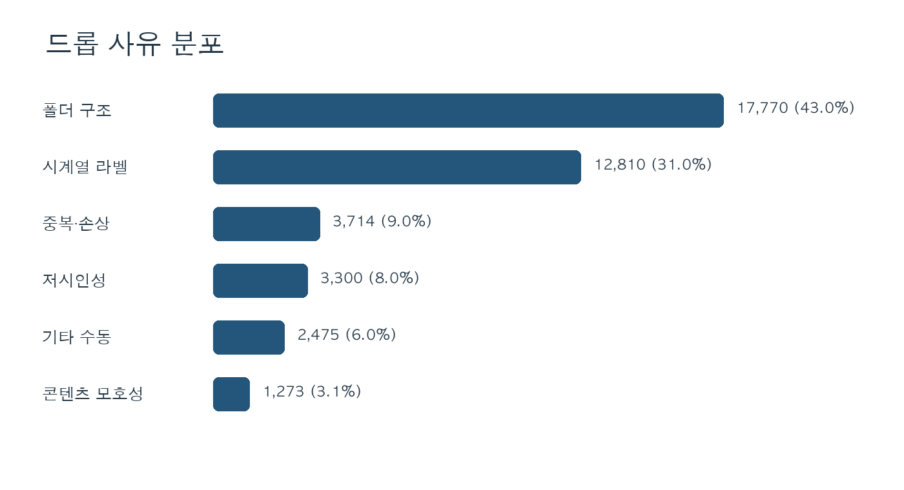
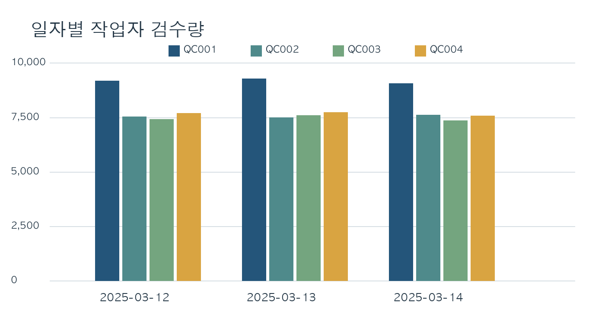
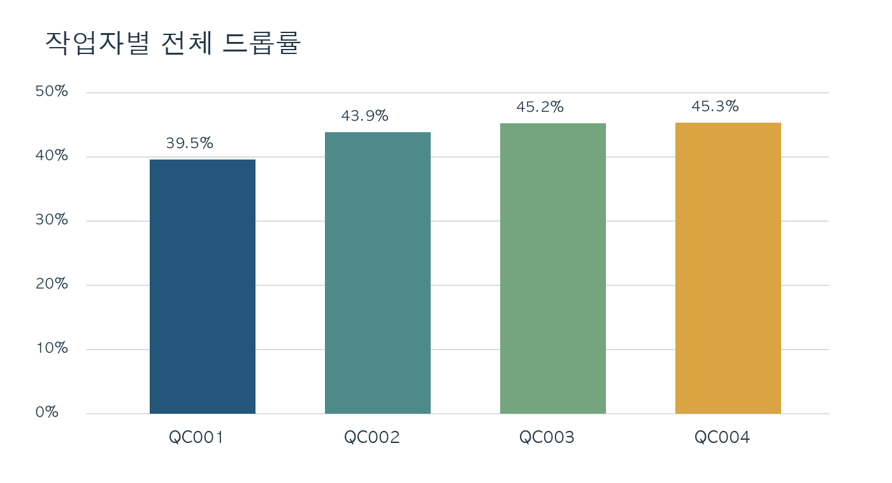

# Synthetic Image QC Log Portfolio

[한국어](README.md) | **English**

A **synthetic-data QC log portfolio** designed around a large-scale image review workflow. It reproduces per-worker and per-day productivity, accept/drop outcomes, drop reasons, and batch-level processing history in a fully reproducible form.

> All data, worker IDs, paths, batch IDs, and figures in this repository are synthetic and created solely to illustrate the portfolio. They do not represent any real company, institution, defense program, facility, equipment, or operating environment.

## What This Project Demonstrates

- Aggregation-consistency checks between event logs and daily summaries
- Codebook-based standardization of QC drop reasons
- KPI computation for review volume, drop rate, and processing time
- Anonymization and data documentation suitable for public release
- Reproducible data quality control via a validation script

## Key Results

| Metric | Result | How it's calculated |
|---|---:|---|
| Total reviewed images | 95,510 | Sum of daily review volume |
| Accepted images | 54,168 | Sum of daily accepted volume |
| Dropped images | 41,342 | Sum of daily dropped volume |
| Overall drop rate | 43.3% | dropped ÷ reviewed |
| Avg. reviewed per worker-day | 7,959 | Total reviewed ÷ 12 worker-days |
| Weighted avg. QC time per image | 1.73 s | Weighted by batch review volume |

The leading drop reasons are folder-structure errors (43.0%) and temporal-annotation errors (31.0%). The 2,475 images whose detailed reason was not separable in the source sample were labeled explicitly as `OTHER_MANUAL` rather than being arbitrarily distributed across existing categories.

> The 43.3% overall drop rate is not an operational metric. It is a synthetic value set intentionally high so that a variety of drop reasons and validation logic can be demonstrated within a single dataset. A real pipeline would be expected to have a much lower drop rate depending on its maturity.

### Drop Reason Distribution



### Daily Review Volume



### Drop Rate by Worker



## Data Layout

### `data/qc_daily_summary.csv`

Provides per-worker, per-day review results with a breakdown of drop reasons. It does not include a `TOTAL` row; aggregates are computed during analysis.

Core validation identities:

```text
reviewed_images = accepted_images + dropped_images
dropped_images = sum(all drop reason columns)
drop_rate = dropped_images / reviewed_images
```

### `data/qc_action_log.csv`

Sample processing events for 48 batches. `main_drop_code` is the representative drop reason for a batch; batches containing both accepted and dropped images are marked `PARTIAL_PASS`. `workflow_status` denotes the downstream processing stage, not an overall quality verdict for the batch.

#### QC Log Sample (first 5 batches)

For readability, only the key columns among all 17 are shown. The values below match the first 5 rows of the source CSV exactly.

| event_ts | worker_id | batch_id | environment_condition | batch_reviewed | batch_accepted | batch_dropped | main_drop_code |
|---|---|---|---|---:|---:|---:|---|
| 2025-03-12 09:43:00 | QC001 | 20250312_01_B1 | rain_wetroad | 2,296 | 1,427 | 869 | LOW_VISIBILITY |
| 2025-03-12 11:50:00 | QC001 | 20250312_01_B2 | day_clear | 2,296 | 1,355 | 941 | LOW_VISIBILITY |
| 2025-03-12 13:04:00 | QC001 | 20250312_01_B3 | day_clear | 2,296 | 1,391 | 905 | LOW_VISIBILITY |
| 2025-03-12 15:44:00 | QC001 | 20250312_01_B4 | night_lowlight | 2,296 | 1,391 | 905 | IMAGE_CONTENT_AMBIGUITY |
| 2025-03-12 09:03:00 | QC002 | 20250312_02_B1 | mixed_indoor_outdoor | 1,882 | 1,117 | 765 | DUPLICATE_CORRUPT |

> `environment_condition` is the capture condition of a batch, while `main_drop_code` is its representative drop reason; the two are not directly causally linked. For example, a `day_clear` batch can still have `LOW_VISIBILITY` as its representative reason — this means low-visibility drops were most frequent in that batch, not that the capture condition itself was low-visibility.

[View the full QC action log](data/qc_action_log.csv)

### `data/drop_codebook.csv`

Defines log codes and their meanings. Every `main_drop_code` is validated to exist in the codebook.

### `data/summary_statistics.csv`

Provides the key metrics and their formulas in a machine-readable form. Ratios are stored as numbers in the 0–1 range, not as `%` strings.

## How to Validate

Run under Python 3, passing the repository root as an argument.

```bash
python tools/validate_data.py .
```

Checks performed:

- Per-day arithmetic consistency of reviewed / accepted / dropped
- Total drops match the sum of detailed reasons
- Per-batch arithmetic consistency of reviewed / accepted / dropped
- Per-worker, per-day batch totals match the daily summary
- Every representative drop code exists in the codebook

## Folder Structure

```text
synthetic-image-qc-portfolio/
├── README.md
├── LICENSE
├── data/
│   ├── drop_codebook.csv
│   ├── qc_action_log.csv
│   ├── qc_daily_summary.csv
│   ├── summary_statistics.csv
│   └── validation_manifest.json
├── charts/
│   ├── daily_review_volume.png
│   ├── drop_reason_distribution.png
│   └── worker_drop_rate.png
├── tools/
│   └── validate_data.py
└── reports/
    ├── qc_analysis.xlsx
    └── qc_summary_report.pdf
```

## Design Principles and Limitations

- The data is a synthetic example meant to illustrate a real workflow structure; it makes no claims about operational performance.
- `main_drop_code` is a batch-level representative reason and does not indicate the individual reason for every dropped image in the batch.
- `OTHER_MANUAL` is a residual drop that lacked detailed classification in the synthetic source; in a real pipeline it could be replaced with a mandatory detailed-reason input.
- NAS paths are fictitious and used only to illustrate structure; they are not real server information.

## License

The code and synthetic data are available under the [MIT License](LICENSE).
